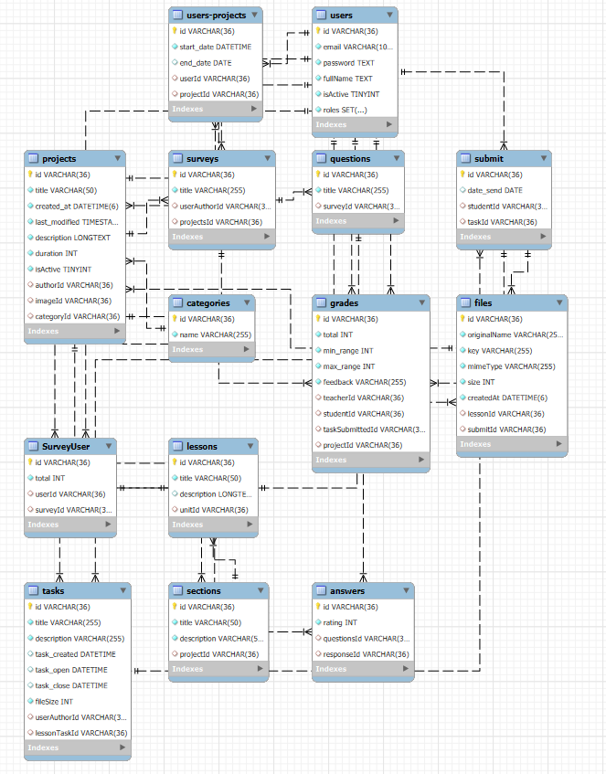
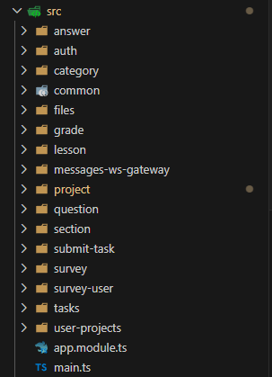

### Backend InnovaLearn

Backend for **InnovaLearn**, an LMS platform currently in development for accessible online education.


## Preview 
- Database Entity-Relation diagram:

- Serving files diagram:

- Structure of project:


## ✨ Features

- **Course CRUD**: Teachers can create and manage courses, units, lessons, materials, and assignments.
- **Assignment review**: Teachers can view and download files submitted by students for assignments.
- **Explore section**: Intuitive interface with category-based filtering to help users discover courses that interest them.
- **Rich text formatting**: Teachers can edit course, lesson, and assignment descriptions using a rich text editor with embedded video support.
- **Calendar**: Users can view past and active assignments in an all-in-one calendar.
- **Analytics dashboard**: Teachers can visualize statistics and insights related to their courses and students.
- **Messaging service**: Real-time web chat that allows users to communicate with others who are online.

---

## 📌 TODO list

- Fix URL retrieval when using the local file system instead of MinIO.
- Task creation currently only works if students are already enrolled, since submissions are automatically generated for assigned students.
  - Reconsider whether this behavior aligns with the project's intended workflow.
- Add Keycloak and Google authentication.
- Refactor DTOs and improve API response structures.
- Implement proper error handling and management.
- In `UserProjects`, retrieve image URLs dynamically.
- Proper architecture in layers, dividing logic between services / repositories.

---

## 🚀 How to deploy

1. Clone the project.
2. Run `npm install`.
3. Copy `env.template` and rename it to `.env`.
4. Configure the environment variables, especially `STORAGE_PROVIDER` depending on whether you are using the local file system or MinIO (`local` | `minio`).
5. If you've chosen to use minIO, remember, you need to paste the license file into the root of the project! By default, the account tend to be user: `minioadmin` password: `minioadmin`
6. Start the database with:

   ```bash
   docker-compose up -d

